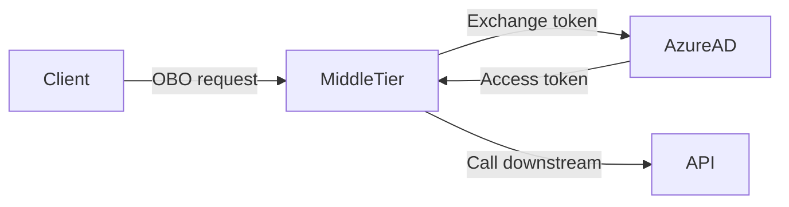

## El escenario: SPA, BFF y una API downstream

Un SPA llama a un BFF en Python; el BFF, a su vez, llama a una API downstream (Microsoft Graph o una API propia protegida por Azure AD). Hoy el BFF se autentica con su propia identidad de servicio (SPN, *client credentials*). Funciona, pero la API downstream solo ve al BFF: si Pedro pide su perfil, Graph devuelve los datos *de la aplicación*, no los de Pedro.

Necesitamos que el BFF actúe **en nombre del usuario**. Eso significa cambiar a *On-Behalf-Of* (OBO). Antes de comparar los flujos, conviene aclarar el vocabulario de Azure, porque el portal usa varios nombres para cosas parecidas.

## Diccionario mínimo de Azure AD (Entra ID)

| Nombre | Qué es | Identificador |
|---|---|---|
| **App Registration** | Definición global de la app (scopes, redirects, secretos). Vive en *App registrations*. | **appId** (Application/client ID) |
| **Service Principal** | Instancia local de la app en un tenant. Guarda permisos consentidos, asignaciones y acceso condicional. Aparece en *Enterprise applications*. | **Object ID** del SP |
| **Tenant ID** | ID del directorio. Va en la authority: `login.microsoftonline.com/{tenantId}`. | GUID |
| **Resource / audience** | Aplicación destinataria del token (`aud`). Se expresa como appId o URI (`api://mi-bff/access_as_user`). | — |
| **Client secret / certificado** | Credencial que prueba ser la app del `client_id`. | — |
| **SPN** | En la práctica, suele significar "autenticarse con la identidad de la app" → *client credentials*. | — |

Una misma app registration tiene un service principal por tenant (multi-tenant). El `appId` es el mismo en todos; el Object ID del SP cambia. El `client_id` que envías en OAuth es siempre el `appId`, nunca un Object ID.

## Client Credentials: el BFF habla con su propia identidad

El BFF llama al endpoint `/token` con `grant_type=client_credentials`, su `client_id` y su `client_secret` (o certificado), pidiendo un scope `.default` sobre la API destino. Azure AD valida la app y sus *Application Permissions* y devuelve un token con la identidad de la **aplicación**:

```json
{
  "aud": "api://mi-api-downstream",
  "iss": "https://login.microsoftonline.com/{tid}/v2.0",
  "sub": "a1b2c3...",          // = appid en este flujo
  "appid": "bff-client-id",
  "idtyp": "app",
  "roles": ["Api.Read"],
  "tid": "{tid}",
  "iat": 1718146800, "exp": 1718150400
}
```

No aparecen `oid`, `upn`, `name` ni `scp`: no hay usuario. Configuración: app registration → *Application Permissions* + *admin consent* + secret/certificado.

**Funciona bien para**: jobs nocturnos, daemons, notificaciones, lecturas de configuración compartida. **Falla cuando la API downstream necesita saber quién es el usuario** (perfil personal, auditoría, autorización por usuario).

## On-Behalf-Of: el BFF habla en nombre del usuario



El BFF recibe un access token dirigido a él (`aud: api://mi-bff/access_as_user`) y lo **intercambia** por otro token dirigido a la API downstream, manteniendo la identidad del usuario. La petición a `/token`:

- `grant_type=urn:ietf:params:oauth:grant-type:jwt-bearer`
- `assertion=<token entrante>`
- `client_id`/`client_secret` del BFF
- `scope=https://graph.microsoft.com/User.Read` (los scopes de la API downstream)
- `requested_token_use=on_behalf_of`

El token resultante:

```json
{
  "aud": "https://graph.microsoft.com",
  "iss": "https://login.microsoftonline.com/{tid}/v2.0",
  "sub": "hash(oid,tid)",
  "oid": "pedro-user-id",
  "upn": "pedro@midominio.com",
  "name": "Pedro García",
  "appid": "bff-client-id",
  "azp":   "spa-client-id",
  "scp":   "User.Read",
  "tid":   "{tid}",
  "iat": 1718146800, "exp": 1718150400
}
```

## SPN vs OBO: lo que cambia en el JWT

| Claim | SPN (client credentials) | OBO (delegado) |
|---|---|---|
| `aud` | API destino | API destino (otra en cada salto de la cadena) |
| `sub` | = `appid` (la app) | hash derivado de `oid` + `tid` |
| `idtyp` | `"app"` | ausente o `"user"` |
| `roles` | Application Permissions | — |
| `scp` | — | Scopes delegados |
| `oid`, `upn`, `name` | — | Identidad del usuario |
| `appid` | App que pidió el token | Intermediario que hizo el intercambio (BFF) |
| `azp` | — | Aplicación que originó la cadena (SPA) |

Cómo identificar el flujo de un vistazo:

- `idtyp=app` o `roles` presentes → client credentials.
- `scp`, `oid` o `upn` presentes → delegado.

Dos confusiones habituales:

- **No uses `sub` para identificar al usuario entre APIs**. `sub` es estable por par (usuario, aplicación), así que el mismo usuario tendrá un `sub` distinto en cada API. Usa **`oid`**.
- **`appid` vs `azp`**: en OBO, `appid` es el intermediario (BFF) y `azp` es la app original (SPA). Si no hay intermediario, son iguales.

## Migrar de SPN a OBO

En la app registration del BFF: cambiar *Application Permissions* por *Delegated Permissions* sobre la API downstream, y **exponer un scope** propio en *Expose an API* (por ejemplo, `api://mi-bff/access_as_user`). Opcionalmente, listar el `appId` del SPA en `knownClientApplications` para que el consentimiento del SPA arrastre los permisos del BFF en cascada.

En la app registration del SPA: añadir ese scope del BFF como permiso delegado.

Consentimiento: permisos de bajo impacto (`User.Read`) los puede consentir el usuario; permisos sensibles (`Mail.Read`, `.All`, etc.) requieren admin consent.

## Código mínimo

SPA con MSAL Browser pide el token dirigido al BFF:

```typescript
import { PublicClientApplication } from "@azure/msal-browser";

const msal = new PublicClientApplication({
  auth: {
    clientId: "spa-client-id",
    authority: "https://login.microsoftonline.com/{tenantId}",
  },
});

const { accessToken } = await msal.acquireTokenSilent({
  scopes: ["api://mi-bff/access_as_user"],
});
// Se envía al BFF en Authorization: Bearer <accessToken>
```

BFF con MSAL Python intercambia ese token por otro para Graph:

```python
import msal, httpx

app = msal.ConfidentialClientApplication(
    client_id="bff-client-id",
    client_credential="bff-client-secret",
    authority="https://login.microsoftonline.com/{tenantId}",
)

def call_downstream(incoming_token: str):
    result = app.acquire_token_on_behalf_of(
        user_assertion=incoming_token,
        scopes=["https://graph.microsoft.com/User.Read"],
    )
    if "error" in result:
        raise RuntimeError(result["error_description"])
    r = httpx.get(
        "https://graph.microsoft.com/v1.0/me",
        headers={"Authorization": f"Bearer {result['access_token']}"},
    )
    return r.json()
```

La diferencia con SPN se reduce a una llamada: `acquire_token_for_client(scopes=[".../.default"])` se sustituye por `acquire_token_on_behalf_of(user_assertion=incoming_token, scopes=[...])`.

## Errores frecuentes

- **AADSTS50013 — assertion failed signature validation**. Estás usando como `assertion` un token cuyo `aud` no es el BFF. Solo puedes intercambiar un token dirigido a tu propia API (`aud: api://mi-bff/...`).
- **AADSTS65001 — consent required**. Falta consentimiento delegado. Reconsiente desde el SPA o usa el endpoint `/adminconsent`.
- **Usar `sub` para identificar al usuario** entre APIs. Cambia por par (usuario, app). Usa `oid`.
- **Pedir `User.Read` con `.default` en OBO** cuando solo necesitas un permiso puntual: pide los scopes explícitos para mantener consentimiento mínimo.

## Cuándo usar cada flujo

| Criterio | Client Credentials (SPN) | On-Behalf-Of |
|---|---|---|
| Hay usuario | No | Sí |
| La API downstream necesita saber quién es | No | Sí |
| Permisos | Application | Delegated |
| Consentimiento | Solo admin | Usuario o admin |
| Token contiene | `roles`, `idtyp=app` | `scp`, `oid`, `upn`, `azp` |
| Uso típico | Daemons, jobs, background | APIs que actúan por un usuario |

Regla práctica: si la API downstream tiene que responder "¿quién es este usuario?" o aplicar permisos de un usuario, OBO. Si solo necesita "¿tiene esta app permiso para hacer esto?", client credentials.

## Referencias

- [OAuth 2.0 On-Behalf-Of flow (Microsoft Entra)](https://learn.microsoft.com/en-us/azure/active-directory/develop/v2-oauth2-on-behalf-of-flow)
- [OAuth 2.0 Client Credentials flow](https://learn.microsoft.com/en-us/azure/active-directory/develop/v2-oauth2-client-creds-grant-flow)
- [Application and service principal objects](https://learn.microsoft.com/en-us/azure/active-directory/develop/app-objects-and-service-principals)
- [MSAL Python](https://learn.microsoft.com/en-us/azure/active-directory/develop/msal-python) — [jwt.ms](https://jwt.ms) para decodificar tokens
